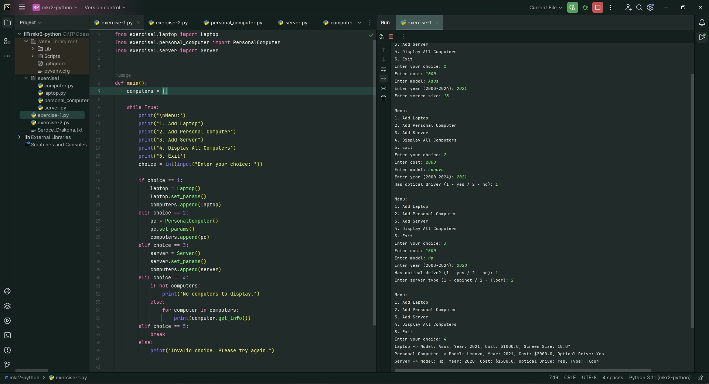
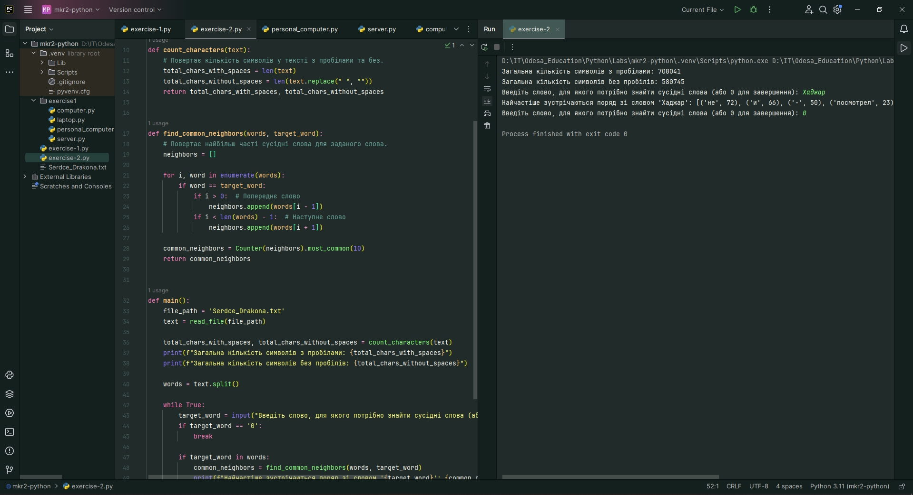

# Модульна контрольна робота 2

1. Створено базовий клас "Комп’ютер". На його основі реалізовано класи "Ноутбук", "Персональний комп’ютер" та "Сервер". Класи мають можливість задавати та отримувати параметри (вартість, модель, рік випуску тощо) заданих за допомогою полів. Для ноутбука визначена діагональ екрана, для ПК та сервера – наявність оптичного приводу, для сервера – тип (шафовий, підлоговий).

Cкриншот результатів:

2. Взято текстовий файл, що містить Мою улюблену художню книгу.

   - Визначено загальну кількість символів у тексті `з пробілами` та `без пробілів`.
   - Визначено, які слова найчастіше зустрічаються поряд (перед або після) з вказаним користувачем словом.

Cкриншот результатів:

